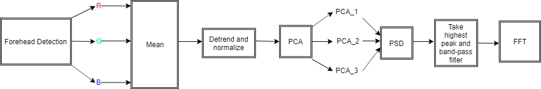

<h1>Heart Rate Research</h1>

The goal of this repo is to mesure heart rate based on variation of color in the forehead reigon.

<h2>Summary</h2>

We start by tracking the forehead and extracting the RGB pixels at every frame and adding the mean of the red component green component and blue component to the buffer. 

 Detrend each of the 3 signals 

 Normalize each of the 3 signals 

 Bandpass filter each of the 3 signals 

 Perform PCA 

 Compute the Power spectral density of each principal component 

 The one with the highest peak is the raw PPG signal 

 Note: if the peaks of the PSD are within 1000 units of each other, we select the signal based on the previous heart rate reading 

